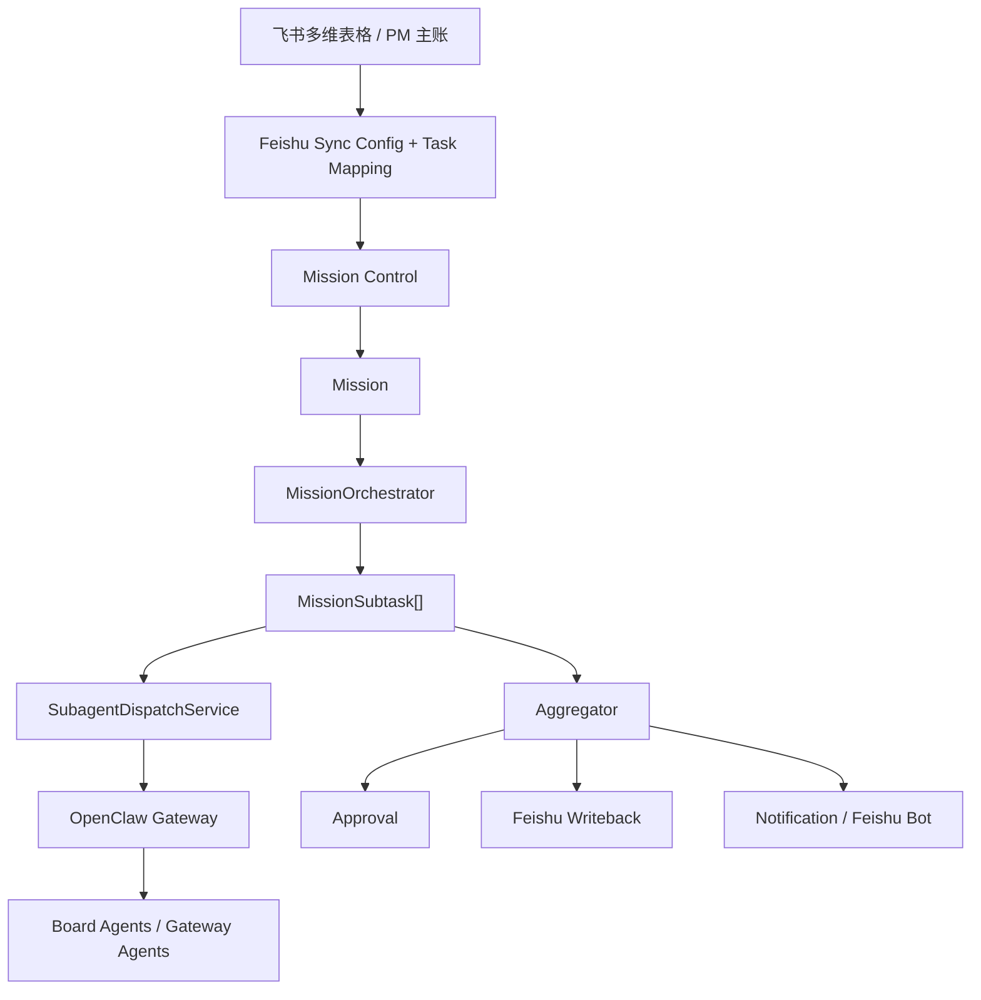

# agentdesgin.md 到当前系统的实现映射

这篇文档回答两件事：

1. [agentdesgin.md](/Users/riqi/project/openclaw-mission-control/agentdesgin.md) 里的岗位设计，落到当前仓库里分别对应什么对象
2. 当前系统距离文档设想的“正式工 + 临时工”多 Agent 组织模型，还差哪几步

## 先说结论

[agentdesgin.md](/Users/riqi/project/openclaw-mission-control/agentdesgin.md) 的方向是对的，但它现在更像“组织设计稿”，不是“系统实现稿”。

当前仓库已经具备这些基础能力：

- Mission / MissionSubtask 作为任务编排和 subagent 拆解的数据骨架
- Board / Agent / Gateway 作为常驻 agent 的运行容器
- Approval 作为人工闸门
- Feishu Sync / Notification 作为外部系统同步与回写通道
- OpenClaw subagent dispatch / aggregation 作为一次性临时工机制

所以这份设计不是重做一套系统，而是把现有对象组合成一套更清晰的“岗位模型”。

## 一、文档里的 5 个正式 agent，对应当前仓库什么

### 1. Orchestrator

在设计稿里，它是总控脑，负责收口、分派、审批和回写时机判断。

当前仓库里，它最接近下面这组对象的组合：

- `Mission`
- `MissionSubtask`
- `MissionOrchestrator`
- `TaskDecomposer`
- `SubagentDispatchService`
- `Aggregator`

对应代码入口：

- [backend/app/models/missions.py](/Users/riqi/project/openclaw-mission-control/backend/app/models/missions.py)
- [backend/app/api/missions.py](/Users/riqi/project/openclaw-mission-control/backend/app/api/missions.py)
- [backend/app/services/missions/orchestrator.py](/Users/riqi/project/openclaw-mission-control/backend/app/services/missions/orchestrator.py)
- [backend/app/services/openclaw/decomposer/decomposer.py](/Users/riqi/project/openclaw-mission-control/backend/app/services/openclaw/decomposer/decomposer.py)
- [backend/app/services/openclaw/subagent_dispatch.py](/Users/riqi/project/openclaw-mission-control/backend/app/services/openclaw/subagent_dispatch.py)

也就是说，当前系统里的 “Orchestrator” 还不是一个独立常驻 Board Agent，而更像一套后端编排服务。

### 2. Sync Agent

在设计稿里，它负责 PM 主账和 Mission Control 之间的双向同步。

当前仓库里，它最接近：

- `FeishuSyncConfig`
- `FeishuTaskMapping`
- Feishu Sync API / writeback service

对应代码入口：

- [backend/app/models/feishu_sync.py](/Users/riqi/project/openclaw-mission-control/backend/app/models/feishu_sync.py)
- [backend/app/api/feishu_sync.py](/Users/riqi/project/openclaw-mission-control/backend/app/api/feishu_sync.py)
- [backend/app/services/feishu/writeback_service.py](/Users/riqi/project/openclaw-mission-control/backend/app/services/feishu/writeback_service.py)

所以当前的 “Sync Agent” 实际上已经部分存在，但主要是服务化实现，不是一个显式可见的常驻 agent。

### 3. Comms Agent

在设计稿里，它负责飞书群沟通、提醒和人工确认。

当前仓库里，它最接近：

- Notification 配置与发送链路
- Approval 创建 / 更新事件
- Feishu bot webhook

对应代码入口：

- [backend/app/api/notifications.py](/Users/riqi/project/openclaw-mission-control/backend/app/api/notifications.py)
- [backend/app/services/notification/notification_service.py](/Users/riqi/project/openclaw-mission-control/backend/app/services/notification/notification_service.py)
- [backend/app/services/notification/feishu_bot.py](/Users/riqi/project/openclaw-mission-control/backend/app/services/notification/feishu_bot.py)

所以当前的 “Comms Agent” 更像通知与渠道服务，而不是常驻会话型 agent。

### 4. Watcher Agent

在设计稿里，它负责巡检、超期提醒、日报周报和高优先级升级。

当前仓库里，它最接近：

- queue worker 定时轮询
- subtask timeout scanner
- dashboard metrics / pending approvals / failed mission 视图

对应代码入口：

- [backend/app/services/queue_worker.py](/Users/riqi/project/openclaw-mission-control/backend/app/services/queue_worker.py)
- [backend/app/services/missions/subtask_timeout.py](/Users/riqi/project/openclaw-mission-control/backend/app/services/missions/subtask_timeout.py)
- [backend/app/api/metrics.py](/Users/riqi/project/openclaw-mission-control/backend/app/api/metrics.py)

所以当前 “Watcher” 仍然更像后端运维规则，不是独立 agent。

### 5. Knowledge Agent

在设计稿里，它负责长期知识整理、纪要、FAQ、背景资料和上下文包。

当前仓库里，它最接近：

- context loader 体系
- Feishu doc / group loader
- 本地文档 / transcript 上下文读取

对应代码入口：

- [backend/app/services/openclaw/context/feishu_doc_loader.py](/Users/riqi/project/openclaw-mission-control/backend/app/services/openclaw/context/feishu_doc_loader.py)
- [backend/app/services/openclaw/context/feishu_group_loader.py](/Users/riqi/project/openclaw-mission-control/backend/app/services/openclaw/context/feishu_group_loader.py)
- [backend/app/services/openclaw/context/loader.py](/Users/riqi/project/openclaw-mission-control/backend/app/services/openclaw/context/loader.py)

所以当前 “Knowledge Agent” 已经有数据入口，但还没有独立人格和独立运行边界。

## 二、文档里的 subagent，对应当前仓库什么

[agentdesgin.md](/Users/riqi/project/openclaw-mission-control/agentdesgin.md) 把 subagent 明确为一次性短活，这和当前仓库已经实现的方向高度一致。

当前对应对象是：

- `MissionSubtask`
- `MissionSubagentIdentity`
- `SubagentDispatchService`
- `PATCH /api/v1/missions/subtasks/{subtask_id}`
- Aggregation / anomaly detection

对应代码入口：

- [backend/app/models/missions.py](/Users/riqi/project/openclaw-mission-control/backend/app/models/missions.py)
- [backend/app/services/openclaw/subagent_identity.py](/Users/riqi/project/openclaw-mission-control/backend/app/services/openclaw/subagent_identity.py)
- [backend/app/services/openclaw/subagent_dispatch.py](/Users/riqi/project/openclaw-mission-control/backend/app/services/openclaw/subagent_dispatch.py)
- [backend/app/services/openclaw/aggregator/anomaly_detector.py](/Users/riqi/project/openclaw-mission-control/backend/app/services/openclaw/aggregator/anomaly_detector.py)
- [backend/app/api/missions.py](/Users/riqi/project/openclaw-mission-control/backend/app/api/missions.py)

这部分是当前系统和设计稿最一致的一块。

## 三、把设计稿翻译成当前系统对象

如果换成“岗位语言”，可以这样读：

- `Mission Control` 不是单一 agent，而是治理层
- `MissionOrchestrator` 是 Orchestrator 的第一实现形态
- `Feishu Sync` 服务是 Sync Agent 的第一实现形态
- `Notification` 服务是 Comms Agent 的第一实现形态
- `queue worker + metrics + timeout scanner` 是 Watcher 的第一实现形态
- `context loaders` 是 Knowledge Agent 的第一实现形态
- `MissionSubtask + dispatch` 是临时工池

## 四、当前设计和实现之间的主要差距

### 差距 1：正式 agent 现在大多是“服务”，不是“常驻人格”

设计稿假设 `Sync / Comms / Watcher / Knowledge` 都是正式工。

但当前仓库里，真正有会话人格和独立 workspace 的，主要还是：

- Gateway Agent
- Board Agent
- Lead Agent

而 `Sync / Comms / Watcher / Knowledge` 现在主要是后端服务、定时任务和上下文加载器。

这不是错，只是说明你现在离“5 个正式 agent”还有一层产品化工作。

### 差距 2：Orchestrator 现在更偏后端编排器，不是可见 agent

当前 `MissionOrchestrator` 已经能做 dispatch、subtask 聚合、redispatch、timeout 收敛，但它不是一个你能在 Gateway 里像普通 agent 一样看到和对话的对象。

如果后面真要落成正式岗位，需要给它：

- 明确的 workspace
- identity/bootstrap
- 独立 session
- 可观测 UI

### 差距 3：Knowledge 仍然是“读上下文”，不是“维护知识”

目前更偏向：

- 拉文档
- 拉群消息
- 组装上下文

还没真正形成：

- 项目 FAQ
- 决策卡片
- 知识索引
- 可复用上下文包

### 差距 4：Watcher 还没独立成业务岗位

你已经有 timeout scan、metrics、pending approvals 和 mission attention 视图，但还没有一个显式的 “Watcher Agent” 去：

- 生成日报
- 发送例行提醒
- 维护风险清单

## 五、最合理的落地顺序

如果按当前仓库继续推进，我建议不是一次上齐 5 个正式 agent，而是分 3 层。

### 第 1 层：先稳定 3 个最必要岗位

- Orchestrator
- Sync
- Comms

理由：

- 它们直接闭环 “任务进来 -> 执行 -> 审批/通知 -> 回写”
- 你现在的 Feishu 联调、Approval、Mission/Subtask 已经有基础

### 第 2 层：Watcher 先做成规则，不急着做人格

先继续强化：

- timeout / retry
- pending approval 监控
- failed mission 聚合
- dashboard attention 视图

等这些规则稳定后，再决定要不要把它包装成常驻 agent。

### 第 3 层：Knowledge 最后单独人格化

先把知识入口和沉淀格式定下来，再决定 Knowledge Agent 是否真的需要长期常驻。

否则很容易先做出一个“什么都管一点”的模糊岗位。

## 六、我对这份设计的具体建议

### 建议 1：把 “5 个正式 agent” 改成 “3 个正式 agent + 2 个能力域”

更稳的表述是：

- 正式 agent：
  - Orchestrator
  - Sync
  - Comms
- 能力域：
  - Watcher capabilities
  - Knowledge capabilities

这样更贴合当前代码现状，也更容易逐步演进。

### 建议 2：明确 “Mission 是编排单元，Board Agent 是执行单元”

现在设计稿里“任务”“mission”“agent”三个词有点混用。

建议统一：

- PM Task：业务任务
- Mission：Mission Control 内部编排单元
- MissionSubtask：临时工子任务
- Board Agent / Gateway Agent：OpenClaw 运行单元

### 建议 3：把审批权从 Orchestrator 里拆成规则

当前系统已经有：

- `Approval`
- Board `require_approval_for_done`
- lead review 流程

所以不要让 Orchestrator “自由裁量审批”，而应该让它“命中规则后创建 Approval”。

这样系统更稳定，也更容易审计。

## 七、一张“设计稿 -> 当前实现”的最短映射表

| 设计稿概念 | 当前最接近实现 | 当前成熟度 |
| --- | --- | --- |
| Orchestrator | `MissionOrchestrator` + decomposer + aggregator | 中 |
| Sync Agent | Feishu Sync / writeback 服务 | 中高 |
| Comms Agent | Notification / Feishu bot 服务 | 中高 |
| Watcher Agent | queue worker + metrics + timeout scan | 中 |
| Knowledge Agent | context loaders | 中低 |
| Subagent | `MissionSubtask` + dispatch + callback | 高 |
| 高风险审批 | `Approval` + board rules + lead review | 高 |

## 八、建议的下一步

如果你要继续按这份设计推进，我建议下一步只做两件事：

1. 给当前系统补一个 “岗位视图” 文档，把 `Orchestrator / Sync / Comms` 先定义成一等对象
2. 在 UI 里把 Mission / Subtask / Approval / Notification 这条链路串成一张完整的操作视图

这样你就不是“先造 5 个 agent”，而是先把当前已经有的能力按岗位语言重新包装清楚。
