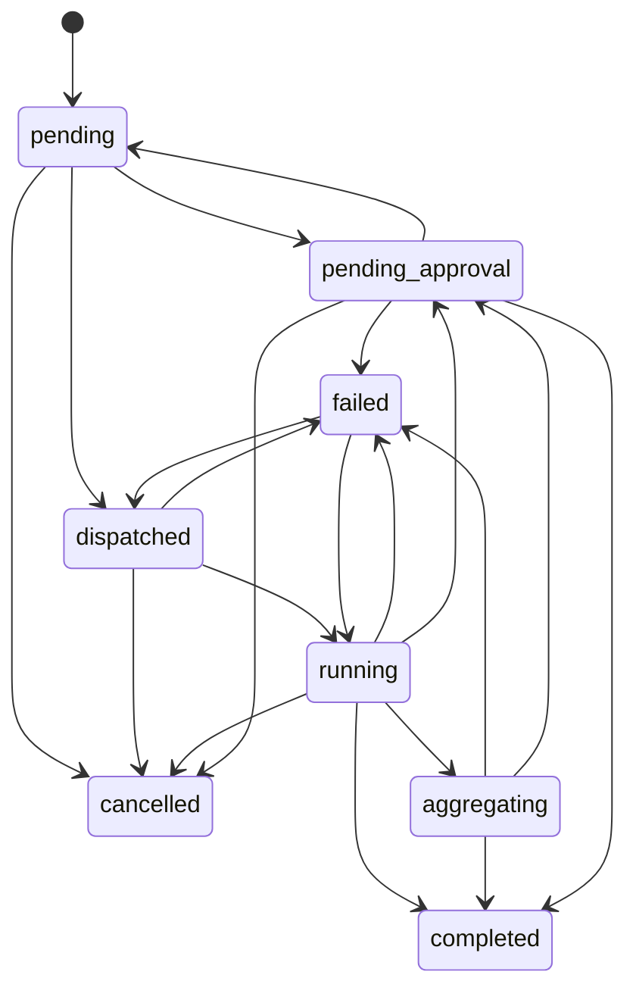
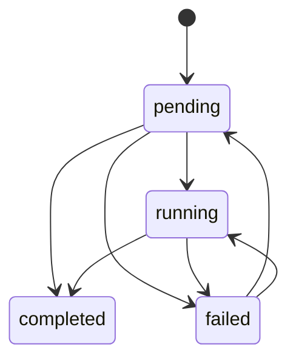

# Mission 状态机

这份文档定义当前 `Mission` 与 `MissionSubtask` 的最小状态机，避免状态字符串散落在模型、路由、服务和前端中。

## Mission

状态集合：

- `pending`
- `dispatched`
- `running`
- `aggregating`
- `completed`
- `failed`
- `pending_approval`
- `cancelled`

推荐主链路：

说明：

- `pending`：mission 已创建，尚未派发。
- `pending -> pending_approval`：用于 `pre_approve` 策略，在真正下发前先停到人工审批。
- `dispatched`：mission 已下发，等待实际执行。
- `running`：mission 已进入执行态。
- `aggregating`：所有 subtask 已进入终态，系统正在聚合结果。
- `pending_approval`：需要人工审批后再收口。
- `completed` / `failed` / `cancelled`：终态。

## MissionSubtask

状态集合：

- `pending`
- `running`
- `completed`
- `failed`

推荐主链路：

说明：

- `failed -> pending` 主要用于手工或系统 `redispatch`
- `pending -> completed` 允许 callback shortcut，适配 subagent 直接回写终态

## 当前实现

收敛位置：

- 状态常量与迁移规则：
  [backend/app/services/missions/status_machine.py](/Users/riqi/project/openclaw-mission-control/backend/app/services/missions/status_machine.py)
- Mission 入口更新：
  [backend/app/services/missions/status_tracker.py](/Users/riqi/project/openclaw-mission-control/backend/app/services/missions/status_tracker.py)
- Mission / Subtask 生命周期：
  [backend/app/services/missions/orchestrator.py](/Users/riqi/project/openclaw-mission-control/backend/app/services/missions/orchestrator.py)
- Mission API 边界：
  [backend/app/api/missions.py](/Users/riqi/project/openclaw-mission-control/backend/app/api/missions.py)
