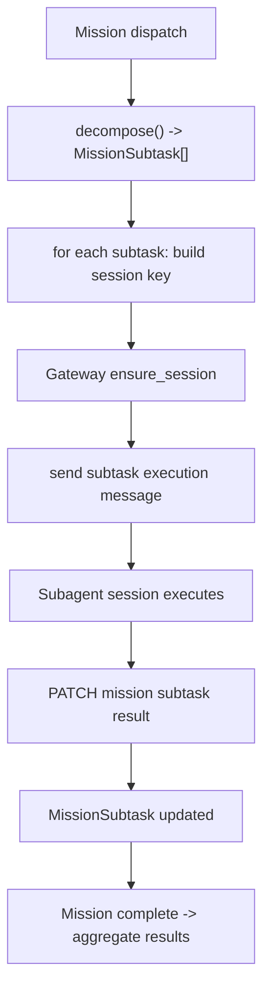

# 真实多 Session Subagent 派发设计与最小实现方案

本文定义 `liuchengtu.md` 中 `④ OpenClaw 拆解任务 -> Subagent们` 与 `⑤ Subagent 结果回流 -> OpenClaw 聚合` 的最小落地方案。

## 目标

当前系统已经具备：

- Mission 创建与分发
- `MissionSubtask` 自动拆解
- Subtask 结果回流
- Mission 级聚合

当前缺口是：

- `MissionSubtask` 还只是数据库对象
- 没有把每个 subtask 真正派发到多个独立 OpenClaw session
- 没有把真实 subagent 的执行状态自动映射回 `MissionSubtask`

本方案的目标是：

1. 为一个 Mission 的多个 subtasks 创建多个独立 OpenClaw session
2. 将每个 subtask 定向发给一个独立 session 执行
3. 将 session 执行结果回流到 `MissionSubtask`
4. 在全部 subtasks 收敛后自动聚合到 Mission

## 当前可复用能力

现有代码里已经有 4 块基础能力可以直接复用：

### 1. Mission / MissionSubtask 模型

- [backend/app/models/missions.py](/Users/riqi/project/openclaw-mission-control/backend/app/models/missions.py)

已具备：

- `Mission`
- `MissionSubtask`
- `assigned_subagent_id`
- `result_summary / result_evidence / result_risk`

### 2. Mission 编排与聚合

- [backend/app/services/missions/orchestrator.py](/Users/riqi/project/openclaw-mission-control/backend/app/services/missions/orchestrator.py)
- [backend/app/services/openclaw/decomposer/decomposer.py](/Users/riqi/project/openclaw-mission-control/backend/app/services/openclaw/decomposer/decomposer.py)
- [backend/app/services/openclaw/aggregator/aggregator.py](/Users/riqi/project/openclaw-mission-control/backend/app/services/openclaw/aggregator/aggregator.py)

已具备：

- dispatch 时自动生成 subtasks
- subtask 状态更新
- complete 时自动聚合为 mission 结果

### 3. Gateway session 基础能力

- [backend/app/services/openclaw/gateway_dispatch.py](/Users/riqi/project/openclaw-mission-control/backend/app/services/openclaw/gateway_dispatch.py)
- [backend/app/services/openclaw/gateway_rpc.py](/Users/riqi/project/openclaw-mission-control/backend/app/services/openclaw/gateway_rpc.py)
- [backend/app/services/openclaw/session_service.py](/Users/riqi/project/openclaw-mission-control/backend/app/services/openclaw/session_service.py)

已具备：

- `ensure_session`
- `send_message`
- `sessions.list`
- `sessions.patch`
- `chat.history`

### 4. OpenClaw Agent / Gateway 板级基础设施

- Board 已绑定 Gateway
- 已有 `Gateway Agent`、`Lead Agent`、`codingAgent`
- 现有任务唤醒和评论链路已验证通过

## 最小架构设计

最小实现不引入新的外部队列或新的 agent 类型，只做 3 件事：

### A. 为每个 subtask 生成稳定 session key

命名规则建议：

```text
subtask:{mission_id}:{subtask_id}
```

例如：

```text
subtask:d7c62890-dc2d-4687-bfdf-12137d9e43b4:0d8400cf-a16e-478d-beb3-85b39c6a9a22
```

这样做的好处：

- 不依赖额外 agent 表记录
- session key 可重复推导
- 便于幂等恢复

### B. 为每个 subtask 发送结构化执行消息

每条 subtask 派发消息至少包含：

- mission id
- subtask id
- label
- description
- tool scope
- expected output
- context refs
- 输出格式要求

建议由新模板生成，例如：

- `SUBTASK_EXECUTION.md.j2`

### C. 结果回流优先走显式 API，不走聊天猜测

最小实现阶段不依赖从 session 聊天内容做 NLP 解析，而是要求 subagent 通过现有后端 API 直接回写：

- `PATCH /api/v1/missions/subtasks/{subtask_id}`

这样能先保证：

- 状态明确
- 结果结构化
- 聚合稳定

## 最小新增组件

### 1. Subagent session identity helper

建议新增：

- `backend/app/services/openclaw/subagent_identity.py`

职责：

- 生成 subtask session key
- 生成 session label

### 2. Subagent dispatch service

建议新增：

- `backend/app/services/openclaw/subagent_dispatch.py`

职责：

- 解析 mission / subtask / board / gateway
- 为 subtask `ensure_session`
- 下发结构化执行消息
- 回填 `assigned_subagent_id`
- 记录 activity

### 3. Mission subagent coordinator

建议新增：

- `backend/app/services/missions/subagent_coordinator.py`

职责：

- 在 `dispatch_mission` 后遍历 subtasks
- 逐条调用 subagent dispatch service
- 标记 subtask 为 `running`

## 最小代码改动点

### 1. Mission dispatch 阶段

修改：

- [backend/app/services/missions/orchestrator.py](/Users/riqi/project/openclaw-mission-control/backend/app/services/missions/orchestrator.py)

建议增加：

- `_dispatch_subtasks_to_sessions(mission)`

流程：

1. `_ensure_subtasks_for_mission`
2. 为每条 subtask 生成 session key
3. `ensure_session`
4. `send_message`
5. 更新 `assigned_subagent_id`
6. 记录 `subtask_dispatched`

### 2. Activity event

建议新增事件类型：

- `subtask_dispatched`
- `subtask_assigned_session`
- `subtask_result_reported`

### 3. API 可观测性

建议新增或扩展：

- `GET /missions/{mission_id}/subtasks`
  - 现有接口保留
  - 前端显示 `assigned_subagent_id`

### 4. Prompt / bootstrap

建议新增模板：

- `backend/templates/SUBTASK_EXECUTION.md.j2`

最小要求：

- 让 subagent 只处理单条 subtask
- 完成后必须调用 subtask update API 回写结果
- 不直接改 mission 总状态

## 最小数据流



## 分阶段实施

### Phase 1: 最小可运行

目标：

- subtasks 真正派发到多个独立 session
- subagent 能用 API 回写 subtask 结果
- mission 可以继续聚合

不做：

- 自动从聊天记录解析结果
- session 级心跳汇总
- subagent 池复用
- 并发调度优化

### Phase 2: 稳定化

补：

- subtask 超时与重试
- session 重入与幂等恢复
- deliver 模式与优先级
- 针对失败 subtask 的自动重派

### Phase 3: 真实 swarm

补：

- subagent 角色模板
- 并行上限控制
- 结果质量评分
- lead/approval 自动介入策略

## 最小验收标准

实现完成后，至少通过这 4 条验收：

1. 一个 mission 能生成 3 条 subtasks
2. 3 条 subtasks 分别拥有不同 `assigned_subagent_id`
3. 3 条 subtasks 能通过 API 回写不同结果
4. mission 最终 evidence 中能聚合出全部 subtask 结果

## 当前不建议一开始就做的事

以下内容先不要放进最小实现：

- 为每个 subtask 建独立 `Agent` 数据库记录
- 引入新的子任务队列表
- 用聊天记录反推 subtask 成败
- 直接把聚合逻辑搬进 Gateway

这些都会增加复杂度，但不会显著提高第一阶段价值。

## 推荐下一步

建议按下面顺序真正开始实现：

1. 新增 `subagent_identity.py`
2. 新增 `subagent_dispatch.py`
3. 在 `MissionOrchestrator.dispatch_mission()` 中接入 subtask session 派发
4. 增加一条 mission e2e 测试，验证 `assigned_subagent_id` 不为空且各不相同
